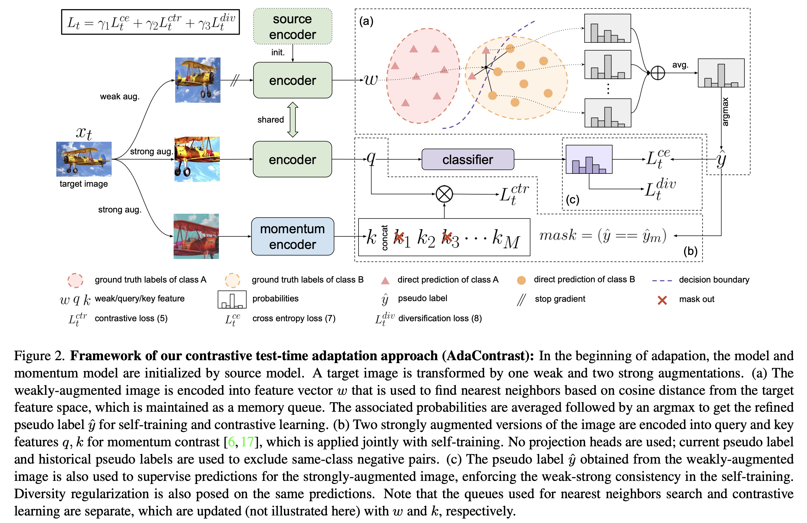
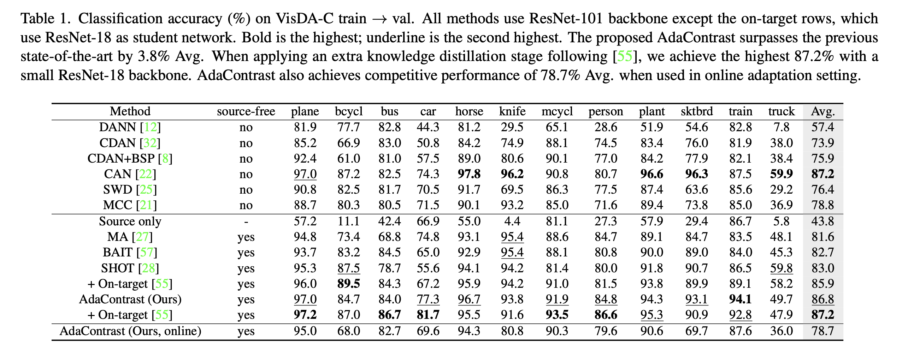
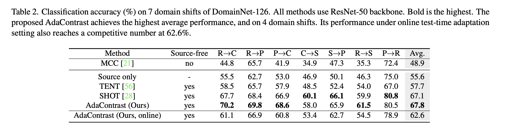

# Contrastive Test-Time Adaptation

This is the official implementation of CVPR 2022 paper [**Contrastive Test-Time Adaptation**](https://arxiv.org/abs/2204.10377), authored by [Dian Chen](https://www.linkedin.com/in/dian-chen-robo8239158), [Dequan Wang](https://dequanwang.dqwang.group/), [Trevor Darrell](https://scholar.google.com/citations?user=bh-uRFMAAAAJ&hl=en), and [Sayna Ebrahimi](https://saynaebrahimi.github.io/).



## Installation

The code is tested with [Pytorch](https://pytorch.org/get-started/locally/) 1.7.1, CUDA 10.1. Please also make sure to install the following packages:

```bash
pip install hydra-core numpy omegaconf sklearn tqdm wandb
```

## VisDA-C

### **Prepare dataset**

Please download the [VisDA-C dataset](https://github.com/VisionLearningGroup/taskcv-2017-public/tree/master/classification), and put it under `${DATA_ROOT}`. For your convenience we also compiled `.txt` files based on the the image labels, provided under `./datasets/VISDA-C/`. The prepared directory would look like:

```bash
${DATA_ROOT}
├── VISDA-C
│   ├── train
│   ├── validation
│   ├── train_list.txt
│   ├── validation_list.txt
```

`${DATA_ROOT}` is set to `./datasets/` by default, which can be modified in `configs/data/basic.yaml` or via hydra command line interface `data.data_root=${DATA_ROOT}`.

### **Training**
We use [hydra](https://github.com/facebookresearch/hydra) as the configuration system. By default, the working directory is `./output`, which can be changed directly from `configs/root.yaml` or via hydra command line interface `workdir=${WORK_DIR}`.

VISDA-C experiments are done for `train` to `validation` adaptation. Before the test-time adaptation, we should have the source model. You may train the source model with script `train_VISDA-C_source.sh` as shown below. We also provide the pre-trained source models from 3 seeds (2020, 2021, 2022) which can be [downloaded from here](https://drive.google.com/drive/folders/16vTNNzzAt4M1mmeLsOxSFDRzBogaNkJw?usp=sharing).

After obtaining the source models, put them under `${SRC_MODEL_DIR}` and run `train_VISDA-C_target.sh` to execute test-time adaptation.

```bash
export CUDA_VISIBLE_DEVICES=0,1,2,3

# train source model
bash train_VISDA-C_source.sh

# train TTA
bash train_VISDA-C_target.sh <SRC_MODEL_DIR>
```

This will reproduce Table. 1 from the main paper:




## DomainNet-126

### **Prepare dataset**

Please download the [DomainNet dataset (cleaned version)](http://ai.bu.edu/M3SDA/), and put it under `${DATA_ROOT}`. Notice that we follow [MME](https://arxiv.org/abs/1904.06487) to use a subset that contains 126 classes from 4 domains, so we also compiled `.txt` files for your convenience based on the the image labels, provided under `./datasets/domainnet-126/`. The prepared directory would look like:

```bash
${DATA_ROOT}
├── domainnet-126
│   ├── real
│   ├── sketch
│   ├── clipart
│   ├── painting
│   ├── real_list.txt
│   ├── sketch_list.txt
│   ├── clipart_list.txt
│   ├── painting_list.txt
```

`${DATA_ROOT}` is set to `./datasets/` by default, which can be modified in `configs/data/basic.yaml` or via hydra command line interface `data.data_root=${DATA_ROOT}`.

### **Training**
We use [hydra](https://github.com/facebookresearch/hydra) as the configuration system. By default, the working directory is `./output`, which can be changed directly from `configs/root.yaml` or via hydra command line interface `workdir=${WORK_DIR}`.

DomainNet-126 experiments are done for 7 domain shifts constructed from combinations of `Real`, `Sketch`, `Clipart`, and `Painting`. Before the test-time adaptation, we should have the source model. You may train the source model with script `train_domainnet-126_source.sh` as shown below. We also provide the pre-trained source models from 3 seeds (2020, 2021, 2022) which can be [downloaded from here](https://drive.google.com/drive/folders/16vTNNzzAt4M1mmeLsOxSFDRzBogaNkJw?usp=sharing).

After obtaining the source models, put them under `${SRC_MODEL_DIR}` and run `train_domainnet-126_target.sh` to execute test-time adaptation.

```bash
export CUDA_VISIBLE_DEVICES=0,1,2,3

# train source model
# example: bash train_VISDA-C_source.sh real
bash train_domainnet-126_source.sh <SOURCE_DOMAIN>

# train TTA
# example: bash train_VISDA-C_target.sh real sketch <SRC_MODEL_DIR>
bash train_domainnet-126_target.sh <SOURCE_DOMAIN> <TARGET_DOMAIN> <SRC_MODEL_DIR>
```

This will reproduce Table. 2 from the main paper:



## Reference

If you find this work helpful to your own work, please consider citing us:
```
@inproceedings{chen2022contrastive,
  title={Contrastive Test-time Adaptation},
  author={Chen, Dian and Wang, Dequan and Darrell, Trevor and Ebrahimi, Sayna},
  booktitle={CVPR},
  year={2022}
}
```